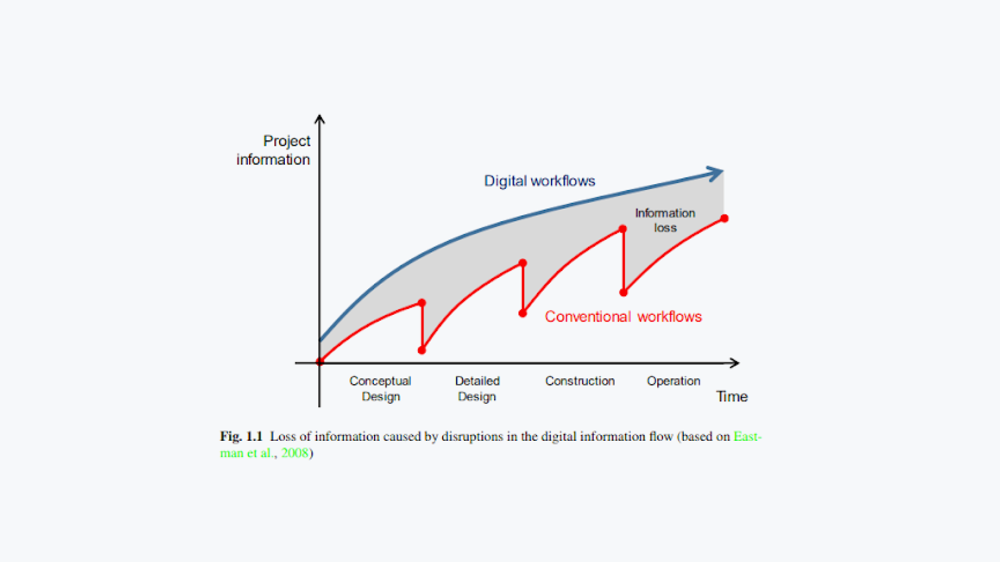
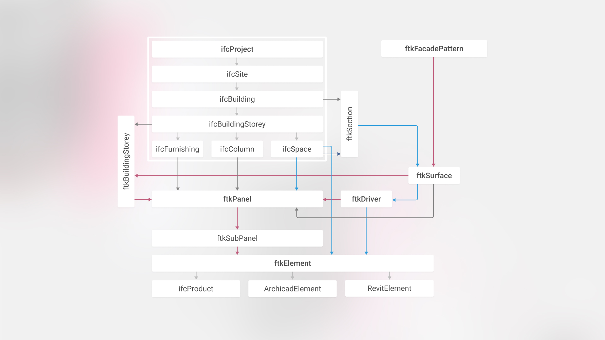
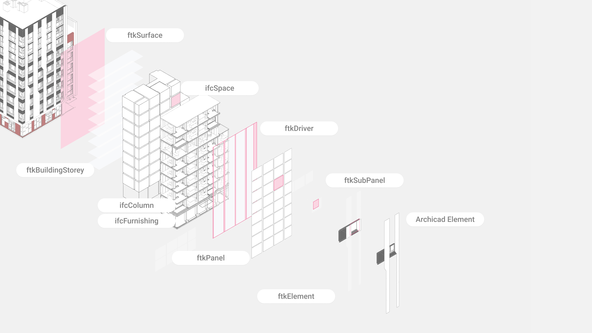

# Facade Toolkit

Work in progress prototype. Set of grasshopper definitions that allow to generate facade patterns, based on prescripted rules. Interoperability workflow for generating 3D Elements into the BIM model.

## Methodology

Developed by [Spatial Tech](https://github.com/sptch) methodology was adopted to Archimatika`s design processes. Set of tools was developed to fit Archimatika technology stack. We use openBIM and interoperability principles to deploy integrated algorithmic workflow.

Common weak in AEC industry is disintegrated old fashioned project life circle. Even using BIM tools and techniques Archimatika still lose data and almost start each design stage from scratch.

In this experiment, we have been trying to implement an automated workflow between different design stages and design team. We automate the design process by integrating algorithms at the early design stage and using feedback mechanisms based on models data exchange.

#### Design Automation steps:

1. [Limits Definition](###Limits-Definition)
2. [Object Inheritance Schema](###Object-Inheritance-Schema)
3. [Design Evaluation](###Design-Evaluation)
4. [Model generation](###Model-generation)

### Limits Definition

Limits that put a demand on a facade based on simple primitives (on early dev stage) and Architectural Model IfcEntities:

| Model element         | Element role                   |
|-----------------------|--------------------------------|
| Breps                 | Massing models allow to define facade surface   |
| IfcSpaces             | Rooms  define extra properties for facade panel   |
| IfcColumns            | Structural elements as limits  |
| IfcWalls              | Walls as limits                |
| IfcFurnishingElement  | Furnishing element (kitchen cabinets, storage, ect) as limits |

### Object Inheritance Schema

  .

### Design Evaluation

### Model generation

## List of the plug-ins we use in the definitions

- [GeometryGymIFC](https://geometrygym.wordpress.com/downloads-windows/)
- [Speckle](https://github.com/speckleworks/SpeckleRhino)
- [Slingshot](https://provingground.io/tools/slingshot/)
- [Human](https://www.food4rhino.com/app/human)
- [HumanUI](https://www.food4rhino.com/app/human-ui)
- [Metahopper](https://www.food4rhino.com/app/metahopper)
- [Telepathy](https://www.food4rhino.com/app/telepathy)
- [Archicad-Grasshopper Connector](https://www.graphisoft.com/downloads/addons/interoperability/rhino.html#live-connection-plugin)

## To Do

- Improve option control and feedback mechanism.
- Design Exploration UI.
- Build Revit interoperability solution, based on [Rhino.Inside](https://github.com/mcneel/rhino.inside/blob/master/Autodesk/Revit/README.md) technology.
- Deploy prototype to production, using [Rhino.Compure](https://github.com/mcneel/compute.rhino3d) service and [Rhino3dm](https://github.com/mcneel/rhino3dm) libraries.
- Have fun with [Hypar](https://hypar.io/).
